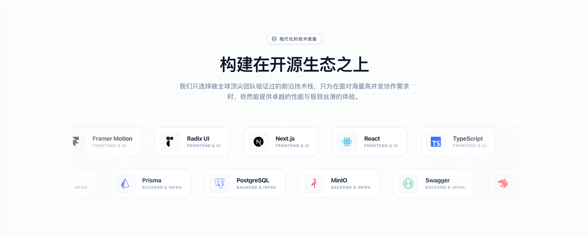
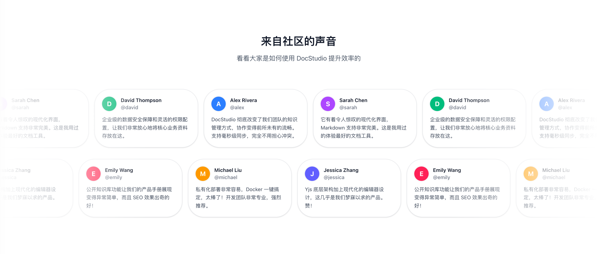
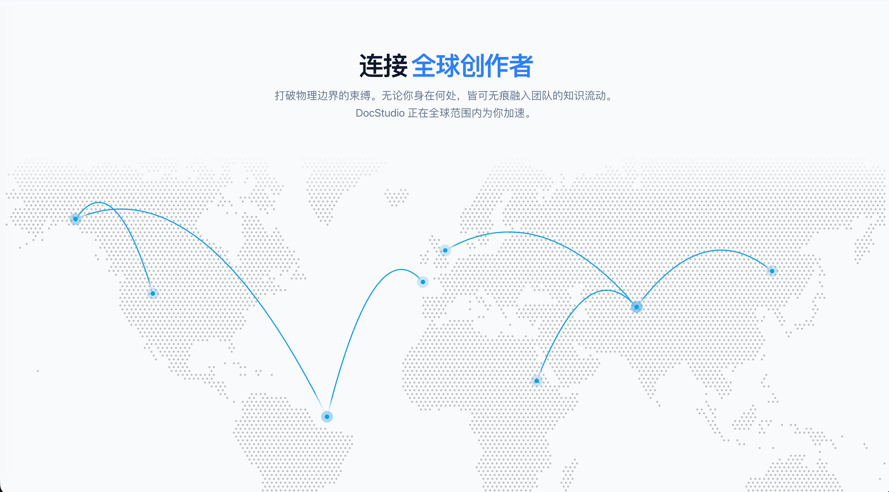

# DocStudio

<div align="center">
  
</div>

DocStudio 是一个**AI 驱动的实时协作知识管理平台**。支持多人实时编辑、AI 辅助写作、文档互链、数据洞察，打造团队知识库的最佳实践。

[](https://www.typescriptlang.org/)
[](https://nextjs.org/)
[](https://nestjs.com/)
[](https://www.prisma.io/)

---

### 核心能力

- **实时协作** — 多人同时编辑，光标实时同步，冲突自动解决（Yjs + Hocuspocus）
- **AI 辅助写作** — 续写/润色/翻译/摘要、Copilot 行内补全、AI 文档对话、深度思考模式
- **知识网络** — `[[` 文档互链、全文搜索、文档树层级管理
- **数据洞察** — 空间数据面板、文档阅读统计、个人生产力指标
- **灵活权限** — 空间/文档级权限、公开/私有切换、带密码的分享链接
- **导入导出** — Markdown/HTML/DOCX 导入，Markdown/HTML/PDF 导出
- **AI 订阅制** — 三档套餐（普通/VIP/Max），申请审批，按月/按年计费

---

<div align="center" style="display: flex; flex-direction: column; gap: 0;">
  
  
  
  
  
  
</div>

## 🚀 快速开始（本地开发）

**前置要求**：Node.js >= 22、pnpm >= 9、Docker Desktop

```bash
# 1. 克隆项目
git clone https://github.com/Jason-chen-coder/DocStudio.git
cd DocStudio

# 2. 安装依赖
pnpm install

# 3. 复制环境变量（本地开发默认值即可直接使用）
cp apps/api/.env.example apps/api/.env

# 4. 启动基础服务（PostgreSQL / Redis / MinIO）
docker-compose up -d

# 5. 初始化数据库
cd apps/api && pnpm exec prisma migrate dev --name init && cd ../..

# 6. 启动开发服务器
pnpm dev
```

访问：前端 http://localhost:3000 · 后端 http://localhost:3001 · MinIO http://localhost:9001

**详细配置** → [DEVELOPMENT.md](./DEVELOPMENT.md)

---

## 🐳 Docker 部署（生产环境）

**前置要求**：Docker & Docker Compose

```bash
# 1. 克隆项目
git clone https://github.com/Jason-chen-coder/DocStudio.git
cd DocStudio

# 2. 配置环境变量
cp .env.example .env
# 编辑 .env，填写域名、密码、API Key 等（必填项见文件内注释）

# 3. 构建并启动所有服务
docker compose -f docker-compose.prod.yml up -d --build
```

首次启动完成后：
- 前端：`http://your-server:3000`
- 后端 API：`http://your-server:3001`
- 超级管理员账号：`.env` 中 `SUPER_ADMIN_EMAIL` / `SUPER_ADMIN_PASSWORD`

> ⚠️ `.env` 中的 `NEXT_PUBLIC_*` 变量在构建时烧入镜像，**修改后需重新执行 `--build`**。

**常用命令：**

```bash
# 查看日志
docker compose -f docker-compose.prod.yml logs -f

# 重启某个服务
docker compose -f docker-compose.prod.yml restart api

# 停止所有服务
docker compose -f docker-compose.prod.yml down

# 更新部署（拉取新代码后）
git pull && docker compose -f docker-compose.prod.yml up -d --build
```

**详细部署说明**（OAuth 配置、Nginx 反代、SMTP 邮件等）→ [DEVELOPMENT.md](./DEVELOPMENT.md)

---

## 📁 项目结构

```
docStudio/
├── apps/
│   ├── web/                    # Next.js 15 前端
│   │   ├── src/app/           # App Router
│   │   └── tailwind.config.ts
│   └── api/                    # NestJS 后端
│       ├── src/
│       ├── prisma/schema.prisma
│       └── .env
├── packages/
│   ├── shared/                 # 共享类型和常量
│   └── config/                 # 共享配置
├── docker-compose.yml          # Docker 服务
└── pnpm-workspace.yaml
```

---

## 🛠️ 技术栈

| 领域       | 技术选型                             |
| ---------- | ------------------------------------ |
| **包管理** | pnpm workspace (Monorepo)            |
| **前端**   | Next.js 16, React 19, Tailwind CSS 4 |
| **后端**   | NestJS 11, Fastify                   |
| **数据库** | PostgreSQL 16, Prisma 5.22           |
| **缓存**   | Redis 7                              |
| **存储**   | MinIO (S3 兼容)                      |
| **协作**   | Yjs + Hocuspocus (WebSocket CRDT)    |
| **编辑器** | Tiptap 3 (ProseMirror)               |
| **AI**     | OpenAI 兼容 API (SSE 流式)           |
| **图表**   | Recharts + D3                        |
| **图像**   | Sharp (压缩/缩略图/WebP)            |
| **语言**   | TypeScript 5.9                       |

---

## 📝 常用命令

### 开发

```bash
pnpm dev              # 启动前后端
pnpm dev:web          # 仅前端
pnpm dev:api          # 仅后端
```

### 构建

```bash
pnpm build            # 构建所有应用
pnpm build:web        # 仅前端
pnpm build:api        # 仅后端
```

### 代码质量

```bash
pnpm lint             # ESLint
pnpm format           # Prettier 格式化
pnpm typecheck        # TypeScript 类型检查
```

### 数据库

```bash
cd apps/api
pnpm exec prisma migrate dev    # 创建迁移
pnpm exec prisma generate       # 生成客户端
pnpm exec prisma studio         # 可视化工具
```

---

## 📚 文档

- **[开发环境配置](./DEVELOPMENT.md)** - 详细的环境搭建指南
- **[Prisma 数据库](./apps/api/PRISMA_SETUP.md)** - 数据库配置和使用
- **[技术规格文档](./DocStudio%20v1%20–%20技术规格文档.md)** - 产品和技术规格

---

### ✅ Stage 0: 基础设施

- [x] Monorepo 项目结构 (pnpm workspace)
- [x] 前端框架 (Next.js 16 + React 19)
- [x] 后端框架 (NestJS 11 + Fastify)
- [x] 数据库 Schema (PostgreSQL + Prisma)
- [x] Docker 开发环境 (PostgreSQL, Redis, MinIO)
- [x] 用户认证 (JWT)

### ✅ Stage 1: 核心功能

- [x] Space 工作空间管理
- [x] Document 文档 CRUD
- [x] Tiptap 富文本编辑器（表格、代码块、Callout、数学公式、绘图）
- [x] 文档树结构与拖拽排序

### ✅ Stage 2: 公开访问层

- [x] 项目首页（动画 Hero + 特性展示 + 用户评价）
- [x] 探索页（公开空间列表 + 排序/分页）
- [x] 公开文档阅读页
- [x] SEO 优化（sitemap / robots.txt / JSON-LD / OG Tags）

### ✅ Stage 3: 团队协作

- [x] 权限管理（Owner/Editor/Viewer）+ 文档级权限
- [x] 成员邀请和管理
- [x] 私密分享链接（密码 + 有效期）+ 分享管理
- [x] Rate Limiting 安全加固

### ✅ Stage 4: 高级功能

- [x] 实时多人协作（Yjs + Hocuspocus + 光标同步）
- [x] 文件上传（Sharp 压缩 + 缩略图 + WebP + 附件）
- [x] 版本历史和恢复
- [x] 全文搜索
- [x] 活动日志 / 最近访问
- [x] 文档模板系统
- [x] 评论系统（行内标注 + 回复 + 解决）

### ✅ Stage 5: 超级管理员

- [x] 平台级超管角色 + 自动 Bootstrap
- [x] 用户管理控制台（搜索/筛选/禁用/删除/改密）

### ✅ Stage 6-7: 产品打磨与增长

- [x] 回收站（软删除 + 30 天自动清理）
- [x] 通知系统（SSE 实时推送 + 8 种类型 + 偏好设置）
- [x] 收藏与快捷访问
- [x] 导入导出（Markdown/HTML/DOCX 导入 + Markdown/HTML/PDF 导出）
- [x] 文档互链（`[[` 语法搜索 + 分享页权限检查）
- [x] 数据洞察（空间面板 + 文档统计 + Dashboard 增强）
- [x] 快捷键弹窗

### ✅ Stage 8: AI 辅助写作

- [x] AI 写作命令（续写/润色/翻译/摘要/扩写/缩写/自定义）
- [x] AI 内联面板（选中文字下方弹出 + 预设命令 + 流式结果）
- [x] Copilot 行内补全（ghost text + Tab 接受）
- [x] AI 文档对话侧栏（多轮对话 + 浮窗/侧栏双模式）
- [x] 深度思考模式 + Markdown 渲染 + 代码高亮
- [x] AI 后台配置（Provider/Key/Model/限额）
- [x] AI 订阅制（三档套餐 + 申请审批 + 按月/按年）
- [x] LLM Provider 抽象层（OpenAI 兼容，支持 MiniMax/DeepSeek）

### ✅ Stage 9: 上线前必备

- [x] 密码重置 / 邮箱验证 / 邮件服务
- [x] OAuth 登录（Google / GitHub）
- [x] 404/500 错误页面 + 全局错误边界
- [x] 安全 Headers + JWT 刷新
- [ ] 移动端适配
- [ ] 新用户引导流程

---

## 🤝 开发工作流

详见：[开发环境配置指南](./DEVELOPMENT.md)

---

## 开发计划

详见：[开发计划](./plan/README.md)

---

## 📄 许可

Private - DocStudio v1 MVP

---

**开发愉快！** 🎉 如有问题请查看 [开发环境指南](./DEVELOPMENT.md)
