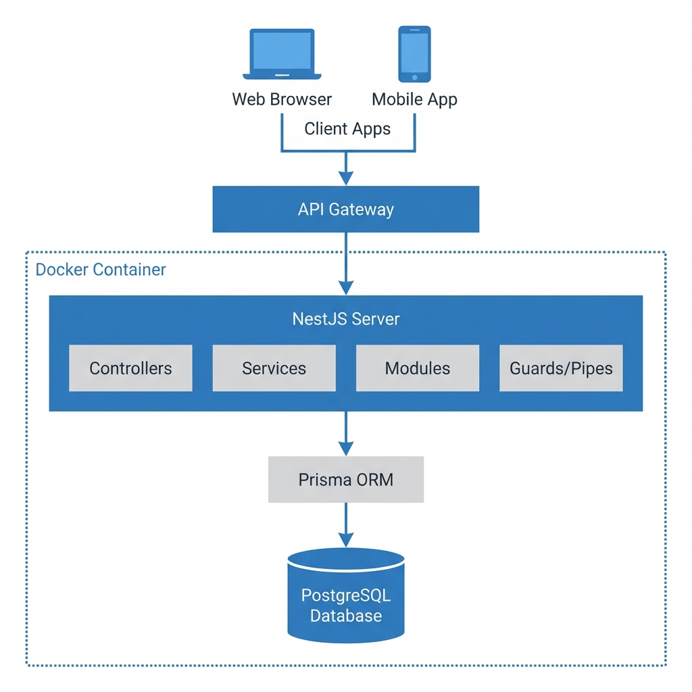

# NestJS 服务开发基础与流程

NestJS 是一个用于构建高效、可扩展 Node.js 服务端应用程序的框架。它深受 Angular 启发，使用 TypeScript 构建，结合了 OOP（面向对象编程）、FP（函数式编程）和 FRP（函数响应式编程）元素。

## 1. 核心概念 (Core Concepts)

### Module (模块)

- **作用**: 组织代码的单元。每个应用至少有一个根模块 (`AppModule`)。
- **装饰器**: `@Module()`
- **属性**:
  - `imports`: 导入其他模块（复用其导出的 Providers）。
  - `controllers`: 注册控制器。
  - `providers`: 注册服务/提供者。
  - `exports`: 导出 Providers 供其他模块使用。

### Controller (控制器)

- **作用**: 处理传入的请求并返回响应。
- **装饰器**: `@Controller('users')`
- **路由方法**: `@Get()`, `@Post()`, `@Put()`, `@Delete()`, `@Patch()`。
- **参数装饰器**: `@Body()`, `@Query()`, `@Param()`, `@Headers()`, `@Req()`。

### Provider (提供者) / Service (服务)

- **作用**: 处理复杂的业务逻辑。
- **装饰器**: `@Injectable()`
- **依赖注入 (DI)**: 通过构造函数注入到 Controller 或其他 Service 中。

### DTO (Data Transfer Object)

- **作用**: 定义网络传输数据的格式。
- **实践**: 使用 `class-validator` 和 `class-transformer` 进行验证和转换。

### Guard (守卫)

- **作用**: 权限验证（如 JWT 认证）。在拦截器和管道之前执行。
- **实现**: 实现 `CanActivate` 接口。

### Pipe (管道)

- **作用**: 数据转换（Transformation）和数据验证（Validation）。
- **常用**: `ValidationPipe` (全局验证 DTO)。

### Interceptor (拦截器)

- **作用**: 在函数执行之前/之后绑定额外的逻辑（如转换响应格式、日志记录）。

## 2. 标准开发流程 (Standard Workflow)

一个标准的 Feature 开发流程（以 `User` 为例）：

### Step 1: 生成资源 (Resouce Generation)

使用 CLI 快速生成样板代码：

```bash
nest g resource users
# 选择 REST API -> 生成 CRUD 样板
```

这会创建 `users` 目录，包含 Module, Controller, Service, DTO, Entity。

### Step 2: 定义 DTO (Define DTOs)

在 `dto/create-user.dto.ts` 中定义接收参数：

```typescript
import { IsString, IsEmail } from 'class-validator';

export class CreateUserDto {
  @IsString()
  name: string;

  @IsEmail()
  email: string;
}
```

### Step 3: 编写业务逻辑 (Implement Service)

在 `users.service.ts` 中调用 Prisma 或数据库：

```typescript
@Injectable()
export class UsersService {
  constructor(private prisma: PrismaService) {}

  create(createUserDto: CreateUserDto) {
    return this.prisma.user.create({ data: createUserDto });
  }
}
```

### Step 4: 实现控制器 (Implement Controller)

在 `users.controller.ts` 中绑定路由：

```typescript
@Post()
create(@Body() createUserDto: CreateUserDto) {
  return this.usersService.create(createUserDto);
}
```

### Step 5: 注册模块 (Register Module)

通常 CLI 会自动将 `UsersModule` 导入到 `AppModule`。如果手动创建，需手动添加。

## 3. 常用技巧

- **ConfigModule**: 使用 `@nestjs/config` 管理环境变量 (`.env`)。
- **Swagger**: 使用 `@nestjs/swagger` 自动生成 API 文档。
- **Global Pipes**: 在 `main.ts` 中启用全局验证：
  `app.useGlobalPipes(new ValidationPipe({ whitelist: true }));`

## 4.后端架构关系图

以下是基于 NestJS + Prisma + PostgreSQL 的后端架构概览：



## 说明

1.  **Client Layer**: Web 端 (Next.js) 和移动端 App 发起请求。
2.  **API Gateway**: 统一入口（通常由 Nginx 或 NestJS 网关模块承担）。
3.  **NestJS Server**: 核心业务逻辑层。
    - **Guards**: 守卫，负责权限验证。
    - **Controllers**: 控制器，处理路由和请求响应。
    - **Services**: 服务层，处理业务逻辑。
    - **Modules**: 模块，组织代码结构。
4.  **Prisma ORM**: 数据访问层，提供类型安全的数据库操作。
5.  **Database**: PostgreSQL 数据库，持久化存储。
6.  **Infrastructure**: 整个后端服务通常运行在 Docker 容器中。
