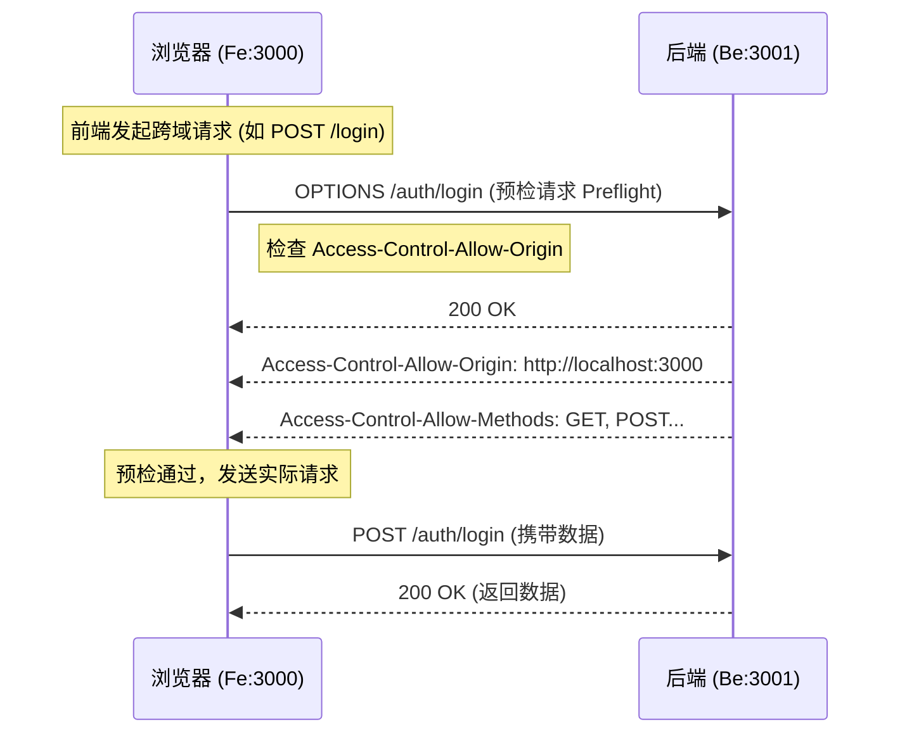

# 前后端对接跨域 (CORS) 解决方案学习文档

本文档详细解析了当前 Doc Studio 项目如何解决前后端分离架构下的跨域资源共享 (CORS) 问题。

## 1. 什么是跨域问题？

在开发环境中：

- **前端**运行在 `http://localhost:3000` (Next.js)
- **后端**运行在 `http://localhost:3001` (NestJS)

由于**协议**、**域名**或**端口**任意一个不同，浏览器出于安全策略（同源策略 Same-Origin Policy），默认会拦截 JavaScript 发起的跨域请求。

## 2. 当前项目的解决方案

本项目采用的是 **后端开启 CORS 支持** 的方案。

相较于“前端代理 (Proxy)”方案，后端开启 CORS 是更标准、更符合生产环境逻辑的做法，因为它明确了哪些来源被允许访问 API。

### 2.1 后端实现 (NestJS)

核心配置位于 `apps/api/src/main.ts`。

后端使用了 Fastify 适配器，因此引入了 `@fastify/cors` 插件来处理 CORS 响应头。

```typescript
// apps/api/src/main.ts

import fastifyCors from '@fastify/cors';

async function bootstrap() {
  const app = await NestFactory.create<NestFastifyApplication>(AppModule, new FastifyAdapter());

  // 注册 CORS 插件
  await app.register(fastifyCors, {
    // 允许的来源：读取环境变量或默认允许本地 3000 端口
    origin: process.env.FRONTEND_URL || 'http://localhost:3000',
    // 允许发送凭证（如 Cookies, Authorization Auth）
    credentials: true,
    // 允许的 HTTP 方法
    methods: ['GET', 'POST', 'PUT', 'DELETE', 'PATCH', 'OPTIONS'],
  });

  // ...
}
```

**关键点解析：**

- **origin**: 指定了允许访问的前端地址。如果不匹配，浏览器会拦截请求。
- **credentials: true**: 允许前端请求携带 `Authorization` 头或 Cookie。如果是 `false`，即使跨域成功，前端也拿不到 Token 或无法发送 Token。

### 2.2 前端实现 (Next.js)

前端代码位于 `apps/web/src/lib/api.ts`。

由于后端已经允许了跨域，前端**不需要**配置 `next.config.js` 的 `rewrites` 或 Proxy。前端直接向后端绝对路径发起请求即可。

```typescript
// apps/web/src/lib/api.ts

// 根据环境区分 API 地址
// 开发环境通常是 http://localhost:3001
const API_URL = process.env.NEXT_PUBLIC_API_URL || 'http://localhost:3001';

async function apiRequest<T>(endpoint: string, options: RequestInit = {}) {
  // 直接请求后端全路径，例如 http://localhost:3001/auth/login
  const response = await fetch(`${API_URL}${endpoint}`, {
    ...options,
    // headers 中包含 Authorization 等
  });
  // ...
}
```

### 2.3 交互流程图



## 3. 其他常见方案对比

| 方案               | 当前项目 | 描述                                                            | 适用场景                                                             |
| :----------------- | :------- | :-------------------------------------------------------------- | :------------------------------------------------------------------- |
| **后端 CORS**      | ✅       | 后端配置允许的 Origin，浏览器直接放行。                         | 现代前后端分离的标准做法，生产环境易于配置 (Nginx/App)。             |
| **前端 Proxy**     | ❌       | Next.js 配置 `rewrites` 将 `/api` 转发到后端。                  | 只有在**无法修改后端代码**，或者为了解决 Cookie 跨域写入问题时使用。 |
| **Nginx 反向代理** | ❌       | 生产环境常用。Nginx 监听 80，将 `/api` 转发后端，`/` 转发前端。 | 生产部署时的最佳实践（此时对浏览器来说是同源的）。                   |

## 4. 故障排查 (Troubleshooting)

如果遇到 CORS 报错：

1.  **报错信息**: `Access to fetch at '...' from origin '...' has been blocked by CORS policy`。
2.  **检查点**:
    - 后端 `main.ts` 中的 `origin` 是否包含当前前端运行的端口？(如 `http://localhost:3000` vs `http://127.0.0.1:3000`)。
    - 是否使用了自定义 Header 但后端未在 `allowedHeaders` 中显式允许？(Fastify Cors 默认通常比较宽松，但需注意)。
    - 如果是生产环境，检查 Nginx 配置是否覆盖了跨域头。
